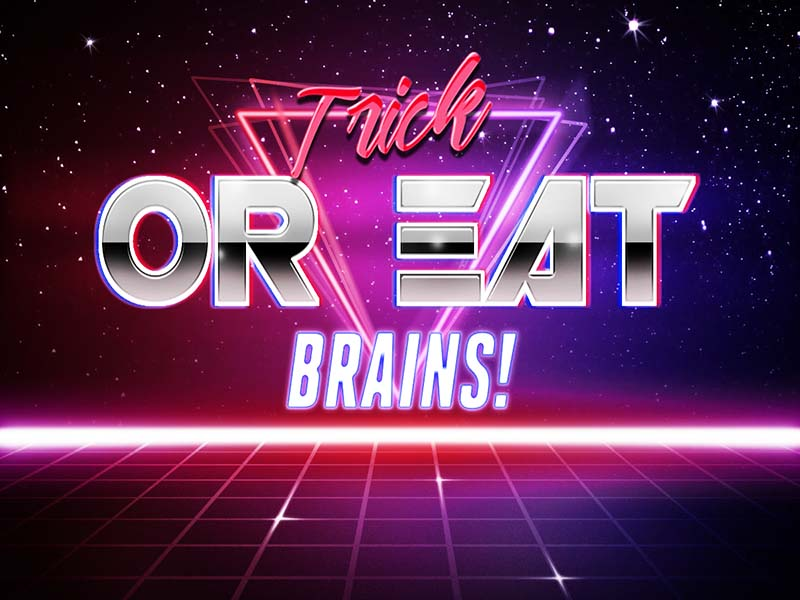
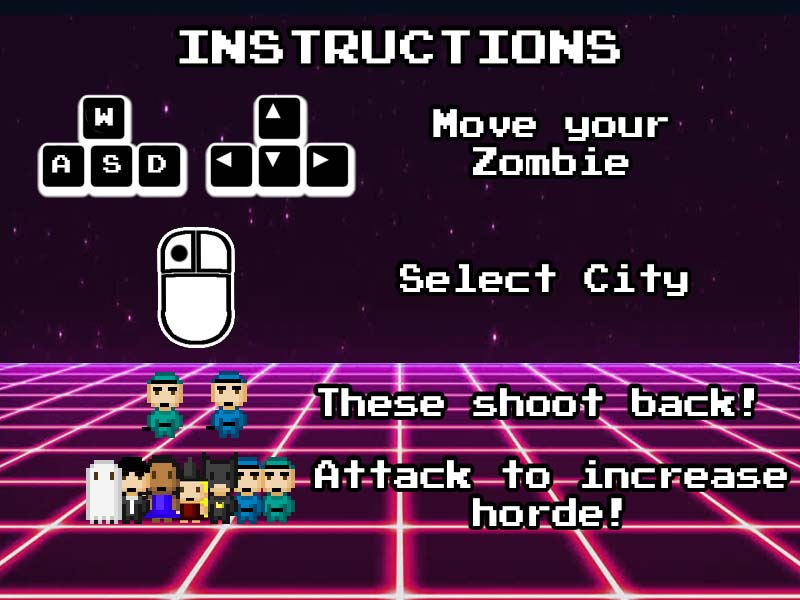

# Zombie infection

[](https://travis-ci.com/Lucx14/zombie-infection)



Code by:
- [Malachy Gilchrist](https://github.com/Mallig)
- [Josh Nickson](https://github.com/joshnickson)
- [James Sutherland](https://github.com/LondonJim)
- [Lucien Najev](https://github.com/Lucx14)

## Technologies

- Javascript, HTML, CSS
- React, (Redux)
- Cypress, Jest, Enzyme
- ESLint

## How to install

```
$ git clone https://github.com/Lucx14/zombie-infection.git
$ cd zombie-infection
$ npm install
```


## How to run

To run unit tests 

```
npm test
```

To run the game
```
npm start
```
To run the feature tests
```
npm cypress:open
```
Running the linter (eslint)
```
npm run lint
```




## Gameplay

### Game Story
It is Halloween of 1986, a time when the boundary between physical and spiritual realms blurs. John is out with his fiance buying candy for the night's trick or treating when a hit and run puts his wife to be in a coma. At the emergency unit John notices a dark figure watching his partner; Death has come for her. John intervenes and makes a deal for his partners life. It turns out that the Reaper wants a day off to enjoy Halloween. Death decides John can take over for a night and if he can reap enough souls before the end of Halloween he can have what he wants. John must leave his soul with Death and send his zombified body through the streets to collect the denizens of towns and cities. John returns to Death with a horde to be reaped, but Death rescinds on the deal and John must use his horde to fight Death and bring back his partner.

### World Map Domination
Infection spreads across the map with a probability function that is modified based on random gameplay events, game success and player stat selection.

A city becomes playable once a cell adjacent to a city is infected.

Pixelated world map drawn using our custom-built wep application[Pixel Mapper](https://github.com/joshnickson/pixel-mapper) to transform a drawn grid of different coloured pixels into an array of numbers to be rendered by the React component into individual objects.

### Top-Down Game

Run around the city turning as many victims as possible into zombies and increasing your hoard. You have a set amount of time and once its over you have the option to spend points on player buffs to increase your speed, aggression and resilience.

### Heroku

Trick or Eat Brains is hosted on heroku at

```
https://trick-or-eat-brains.herokuapp.com/
```


